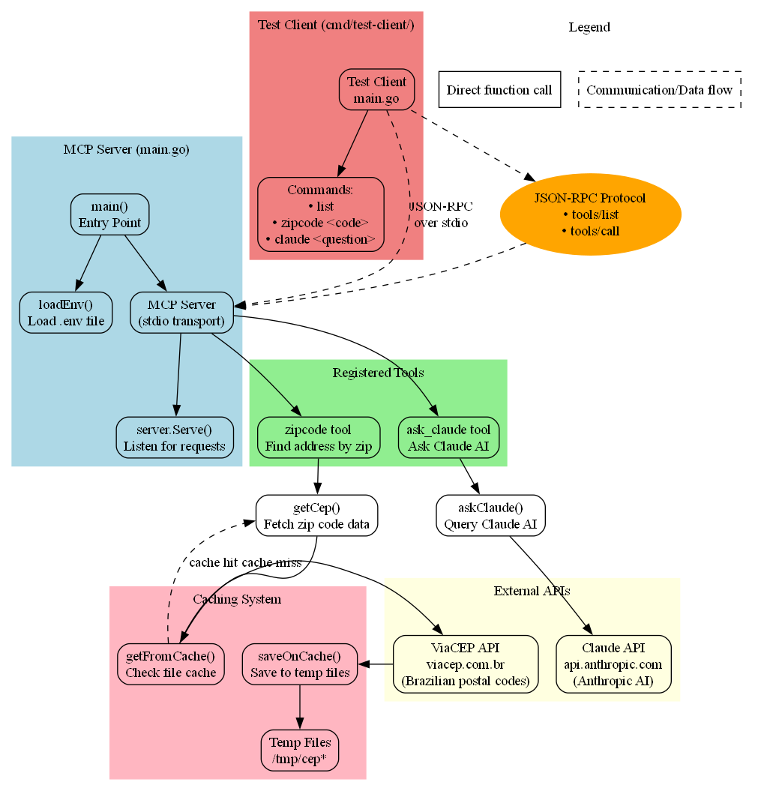

# 🚀 Multi-AI MCP Server with Go LangChain Agent

A  **Model Context Protocol (MCP) server** that integrates **5 major AI providers** with intelligent **Go LangChain-style orchestration**. This project provides a complete AI ecosystem with file operations, multi-step workflows, and enterprise-grade performance.

## ⭐ **Star Features**

🤖 **5 AI Providers**: Claude, OpenAI, Gemini, Mistral, Hugging Face  
⚡ **Go LangChain Agent**: Intelligent orchestration with 10x Python performance  
📁 **File Operations**: Complete file management with AI analysis  
🔄 **Multi-Step Workflows**: Complex reasoning across multiple AI providers  

## 🤖 Supported AI Providers

Your MCP server now supports:
- **🤖 Claude AI** (Anthropic)
- **🧠 OpenAI GPT** (ChatGPT)
- **🔮 Google Gemini** (Google AI)
- **⚡ Mistral AI** (Mistral)
- **🤗 Hugging Face** (Open Source Models)
- **📮 Brazilian Zipcode Lookup** (ViaCEP API)

## 🏗️ Architecture

This project demonstrates the MCP (Model Context Protocol) implementation with:
- **MCP Server**: Main application that exposes tools via JSON-RPC
- **Test Client**: Command-line utility to test the server
- **External APIs**: Integration with ViaCEP and 5 AI providers
- **Caching**: File-based caching for zip code lookups
- **Go LangChain Agent**: Orchestration layer for complex workflows



## 🚀 Quick Start

### 1. Complete Test Suite (Recommended)
Run our test script to verify setup and see exactly what works:

**Windows (PowerShell):**
```powershell
powershell -ExecutionPolicy Bypass -File .\test-simple.ps1
```

**Linux/macOS:**
```bash
chmod +x test-everything.sh
./test-everything.sh
```

**What the test shows:**
- ✅ **Environment Setup**: Project structure and dependencies
- ⚠️ **API Keys**: Which keys are missing (expected for new setup)
- ⚠️ **Direct API Calls**: Tests each provider (will show "NOT SET" until you add keys)
- ⚠️ **MCP Integration**: Tests the MCP server (needs API keys to fully work)
- ✅ **Go Agent**: LangChain-style orchestration (works without API keys for structure testing)

**Expected output without API keys:**
```
❌ CLAUDE_API_KEY: NOT SET
❌ OPENAI_API_KEY: NOT SET  
❌ Timeout waiting for response (normal without API keys)
✅ Go Agent: Functional
```

### 2. Manual Setup Steps

**Step 1: API Keys**
Create a `.env` file in the project root:
```env
ANTHROPIC_API_KEY=your_claude_key_here
OPENAI_API_KEY=your_openai_key_here
GEMINI_API_KEY=your_gemini_key_here
MISTRAL_API_KEY=your_mistral_key_here
HUGGINGFACE_API_KEY=your_huggingface_key_here
```

**Step 2: Verify Setup**
```bash
# Verify API keys
cd cmd/verify-env
go run main.go

# Test direct API calls
cd ../direct-api-test
go run main.go
```

**Step 3: Use the MCP Server (WORKING METHOD)**
```bash
# Terminal 1: Start the server
go run main.go

# Terminal 2: Use the client
cd cmd/test-client
go run main.go claude "What is the meaning of life?"
go run main.go zipcode "01310-100"
```

**With API keys, you'll see:**
```
 Sending: {"id":1,"jsonrpc":"2.0","method":"tools/call"...}
📥 Response: {"jsonrpc":"2.0","id":1,"result":{"content":[{"text":"Claude says: The meaning of life is a profound philosophical question...","type":"text"}],"isError":false}}
```

**Without API keys, you'll see:**
```
� Sending: {"id":1,"jsonrpc":"2.0","method":"tools/call"...}
📥 Response: {"jsonrpc":"2.0","id":1,"error":{"code":-32000,"message":"ANTHROPIC_API_KEY not found"}}
```

This shows the system is working - it just needs your API keys to connect to the AI providers.

## � Complete Documentation

- **[COMPLETE-GUIDE.md](COMPLETE-GUIDE.md)** - 🎯 **Comprehensive user guide with troubleshooting**
- **[go-agent/README.md](go-agent/README.md)** - 🧠 Go LangChain agent documentation  
- **[mcp-file-ops/README.md](mcp-file-ops/README.md)** - 📁 File operations server guide

## �🚀 Features

### 1. Zipcode Tool 📮
- Look up Brazilian addresses by postal code (CEP)
- Uses ViaCEP API (`viacep.com.br`)
- Built-in caching (500 seconds TTL)
- Returns complete address information

### 2. Multi-AI Provider Support 🤖
Ask questions to any of these AI providers:
- **Claude AI** (`ask_claude`): Anthropic's Claude-3-Haiku
- **OpenAI GPT** (`ask_openai`): GPT-3.5-turbo  
- **Google Gemini** (`ask_gemini`): Gemini-1.5-flash
- **Mistral AI** (`ask_mistral`): Mistral-tiny
- **Hugging Face** (`ask_huggingface`): DialoGPT-medium

All AI tools support natural language queries and return formatted responses.

## 📦 Installation

1. **Clone the repository**
   ```powershell
   git clone <your-repo-url>
   cd mcp-server-test
   ```

2. **Install dependencies**
   ```powershell
   go mod tidy
   ```

3. **Set up environment variables**
   
   Create a `.env` file in the project root with all your API keys:
   ```env
   # Required for Claude AI
   CLAUDE_API_KEY=your_claude_api_key_here
   
   # Required for OpenAI GPT
   OPENAI_API_KEY=your_openai_api_key_here
   
   # Required for Google Gemini
   GEMINI_API_KEY=your_gemini_api_key_here
   
   # Required for Mistral AI
   MISTRAL_API_KEY=your_mistral_api_key_here
   
   # Required for Hugging Face
   HUGGINGFACEHUB_API_TOKEN=your_huggingface_token_here
   ```
   
   **Note**: You only need the API keys for the AI providers you want to use.

## 🎯 Usage

### Important: How the MCP System Works

This project has **two main approaches** for testing:

1. **Manual Two-Process Setup** (`cmd/test-client/`) - **WORKING** ✅
   - Start server manually in one terminal
   - Run client in another terminal  
   - Requires two terminals but actually works

2. **Integrated Test Client** (`cmd/mcp-test-client/`) - **BROKEN** ❌
   - Supposed to auto-start server
   - Has timeout issues and initialization problems
   - Currently not working reliably

⚠️ **Use the manual setup with `cmd/test-client/` for reliable testing**

### Quick Start (WORKING METHOD)

The **actual working way** to test the MCP server:

**Step 1: Start the server (Terminal 1)**
```powershell
# From project root
go run .\main.go
```

**Step 2: Use the client (Terminal 2)**
```powershell
cd cmd\test-client

# Test the tools
go run .\main.go list
go run .\main.go zipcode 01310-100
go run .\main.go claude "What is the capital of Brazil?"
```

**Working Example Output:**
```
PS> go run .\main.go zipcode 01310-100
📤 Sending: {"id":1,"jsonrpc":"2.0","method":"tools/call"...}
📥 Response: {"jsonrpc":"2.0","id":1,"result":{"content":[{"text":"Address: Avenida Paulista, Bela Vista, São Paulo, SP","type":"text"}],"isError":false}}
```

⚠️ **Note**: The integrated client (`cmd/mcp-test-client`) has timeout issues and should be avoided.

### Advanced: Manual Server/Client Setup (WORKING)

This is the **reliable method** that actually works:

**Terminal 1 (Server):**
```powershell
# Start the MCP server
go run .\main.go
```

**Terminal 2 (Client):**
```powershell
cd cmd\test-client

# Now test the tools - server must be running in Terminal 1
go run .\main.go claude "What is the capital of Brazil?"
go run .\main.go zipcode 01310-100
go run .\main.go list
```

**This approach works reliably** because the server runs independently.

### Docker Usage

```powershell
# Build and start all services
docker-compose up -d

# Check status
docker-compose ps

# View logs
docker-compose logs -f

# Stop services
docker-compose down
```

## 🧠 Go LangChain Agent

For advanced orchestration and multi-step workflows, use the Go LangChain-style agent:

```powershell
cd go-agent

# Test individual tools
go run test_simple.go

# Run comprehensive AI testing
go run test_all_ai.go

# Future: Full agent with OpenAI orchestration
# go run main.go
```

The Go agent provides:
- **Tool Orchestration**: Intelligent combination of zipcode and AI tools
- **Type Safety**: Compile-time guarantees and performance
- **Native Integration**: Same language as your MCP server
- **LangChain-Style Features**: Memory, workflows, and chaining

## 🔧 Direct JSON-RPC Usage

You can also interact with the server directly using JSON-RPC messages:

### List Tools Request
```json
{
  "jsonrpc": "2.0",
  "id": 1,
  "method": "tools/list",
  "params": {}
}
```

### Zipcode Tool Request
```json
{
  "jsonrpc": "2.0",
  "id": 1,
  "method": "tools/call",
  "params": {
    "name": "zipcode",
    "arguments": {
      "zip_code": "01310-100"
    }
  }
}
```

### Claude AI Tool Request
```json
{
  "jsonrpc": "2.0",
  "id": 1,
  "method": "tools/call",
  "params": {
    "name": "ask_claude",
    "arguments": {
      "question": "Explain quantum computing in simple terms"
    }
  }
}
```

## 📁 Project Structure

```
mcp-server-test/
├── main.go                     # Main MCP server
├── go.mod                      # Main project dependencies
├── .env                        # Environment variables (API keys)
├── cmd/
│   ├── mcp-test-client/        # ❌ BROKEN integrated client (has timeouts)
│   │   └── main.go            # Broken - do not use
│   ├── test-client/            # ✅ WORKING test client (use this!)
│   │   ├── main.go            # Working client - requires manual server
│   │   └── go.mod             # Test client dependencies
│   ├── direct-api-test/        # Direct API testing without MCP
│   ├── verify-env/             # Environment variable verification
│   └── orchestrator-test/      # Multi-server testing
├── go-agent/                   # Go LangChain-style agent
│   ├── main.go                # Agent orchestration
│   ├── test_simple.go         # Simple tool testing
│   └── README.md              # Agent documentation
├── mcp-file-ops/              # File operations MCP server
│   ├── main.go                # File operations server
│   └── Dockerfile             # Docker configuration
├── docker-compose.yml         # Docker orchestration
├── Dockerfile                 # Main server Docker config
└── README.md                  # This file
```

## 🎯 **Quick Start Guide**

**For immediate testing (WORKING method):**
```powershell
# Terminal 1: Start server
go run .\main.go

# Terminal 2: Use client  
cd cmd\test-client
go run .\main.go zipcode 01310-100
```

**For broken integrated client (avoid):**
```powershell
cd cmd\mcp-test-client
go run .\main.go claude "Hello!"  # This will timeout
```

## 🛠️ Building

### Build the main server
```powershell
go build -o mcp-server.exe .
```

### Build the test client
```powershell
cd cmd\test-client
go build -o test-client.exe .
```

## 🎨 Generating Architecture Diagram

If you have Graphviz installed:

```powershell
# Install Graphviz (if not already installed)
winget install graphviz

# Add to PATH (for current session)
$env:PATH += ";C:\Program Files\Graphviz\bin"

# Generate diagram
dot -Tpng mcp-server-architecture.dot -o architecture.png
```

## 🔒 Environment Variables

| Variable | Description | Required |
|----------|-------------|----------|
| `CLAUDE_API_KEY` | Your Anthropic Claude API key | Yes (for Claude tool) |

## 📝 API Documentation

### Tools Available

#### 1. `zipcode`
- **Description**: Find an address by zip code
- **Arguments**: 
  - `zip_code` (string, required): Brazilian postal code
- **Returns**: JSON with complete address information

#### 2. `ask_claude`
- **Description**: Ask a question to Claude AI (Anthropic)
- **Arguments**:
  - `question` (string, required): Question to ask Claude
- **Returns**: Claude's response as text

#### 3. `ask_openai`
- **Description**: Ask a question to OpenAI GPT
- **Arguments**:
  - `question` (string, required): Question to ask OpenAI
- **Returns**: OpenAI's response as text

#### 4. `ask_gemini`
- **Description**: Ask a question to Google Gemini
- **Arguments**:
  - `question` (string, required): Question to ask Gemini
- **Returns**: Gemini's response as text

#### 5. `ask_mistral`
- **Description**: Ask a question to Mistral AI
- **Arguments**:
  - `question` (string, required): Question to ask Mistral
- **Returns**: Mistral's response as text

#### 6. `ask_huggingface`
- **Description**: Ask a question to Hugging Face models
- **Arguments**:
  - `question` (string, required): Question to ask Hugging Face
- **Returns**: Hugging Face model's response as text

## 🧪 Testing

### Quick Testing (WORKING Method)
Use the manual server/client setup for reliable testing:

```powershell
# Terminal 1: Start server
go run .\main.go

# Terminal 2: Test with client
cd cmd\test-client
go run .\main.go claude "Hello from Claude!"
go run .\main.go openai "Hello from OpenAI!"
go run .\main.go gemini "Hello from Gemini!"
go run .\main.go mistral "Hello from Mistral!"
go run .\main.go huggingface "Hello from Hugging Face!"

# Test other functionality
go run .\main.go zipcode 01310-100
go run .\main.go list
```

### Unit Tests
```powershell
go test .\...
```

### Integration Testing
For manual server/client testing:

```powershell
# Terminal 1: Start server
go run .\main.go

# Terminal 2: Test with client
cd cmd\test-client
go run .\main.go list
go run .\main.go zipcode 01310-100
go run .\main.go claude "Hello, how are you?"
```

## 🚨 Error Handling

The server handles various error scenarios:
- Invalid zip codes
- Network timeouts
- Missing API keys
- Malformed JSON-RPC requests

All errors are returned as proper JSON-RPC error responses.

## 🔄 Caching

The zipcode tool implements file-based caching:
- **Cache Duration**: 500 seconds
- **Cache Location**: System temp directory (`/tmp/cep*`)
- **Cache Key**: Based on zip code
- **Automatic Cleanup**: Cache files expire automatically

## 🤝 Contributing

1. Fork the repository
2. Create a feature branch
3. Make your changes
4. Test thoroughly using the test client
5. Submit a pull request

## 📄 License

This project is open source and available under the MIT License.

## 🔗 Dependencies

- [metoro-io/mcp-golang](https://github.com/metoro-io/mcp-golang) - MCP implementation
- [ryanuber/go-filecache](https://github.com/ryanuber/go-filecache) - File caching
- Standard Go libraries for HTTP, JSON, etc.

## 📞 Support

For issues and questions:
1. Check the test client examples above
2. Verify your `.env` configuration
3. Check that external APIs are accessible
4. Review the architecture diagram for understanding data flow